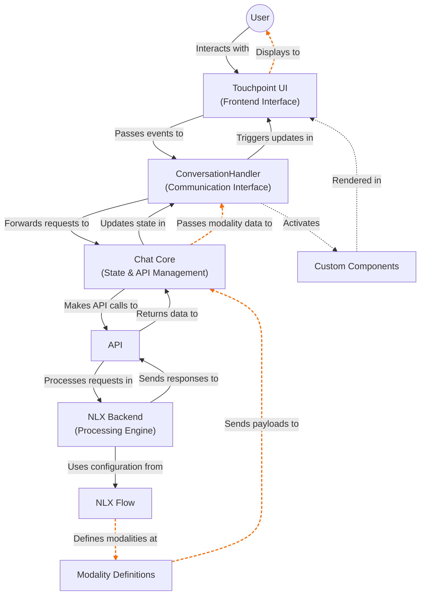

- [Architecture](#architecture)
  - [Core Components](#core-components)
- [Key Concepts](#key-concepts)
  - [Custom Components](#custom-components)
  - [The ConversationHandler](#the-conversationhandler)
- [Implementation Patterns](#implementation-patterns)
  - [Pattern 1: Simple Chat Integration](#pattern-1-simple-chat-integration)
  - [Pattern 2: Themed Chat with Custom Components](#pattern-2-themed-chat-with-custom-components)
  - [Pattern 3: Programmatic Control](#pattern-3-programmatic-control)

Touchpoint UI provides a powerful, flexible conversation interface that connects your application with your NLX conversational applications. Understanding the fundamental architecture and data flow will help you build more advanced implementations.

## Architecture



### Core Components

| Component         | Role                      | Responsibility                                                         |
| ----------------- | ------------------------- | ---------------------------------------------------------------------- |
| **Touchpoint UI** | Frontend interface        | Renders the chat window, messages, input fields, and custom components |
| **Chat Core**     | Communication layer       | Manages conversation state and handles API communication               |
| **NLX**           | Configuration environment | Where you design flows, intents, slots, and define modalities          |

## Key Concepts

### Custom Components

Custom Components and Modalities connect your applications with custom UI components in Touchpoint:

```javascript
// In Touchpoint initialization:
const touchpoint = await create({
  // Other config options...
  customModalities: {
    ProductCard: ProductCardComponent,
    DateSelector: DatePickerComponent,
  },
});
```

When NLX sends a modality payload, Touchpoint automatically renders your custom component, passing:

- `data`: The modality payload from NLX
- `conversationHandler`: Interface to continue the conversation

See the [Custom Components Guide](/guide-building-custom-components) to get started

### The ConversationHandler

This object (`touchpoint.conversationHandler`) is your interface for programmatic interaction:

```javascript
// Get the conversation handler from your touchpoint instance
const { conversationHandler } = touchpoint;

// Send a text message
conversationHandler.sendText("Hello");

// Send a choice selection
conversationHandler.sendChoice("option_123");

// Send structured data (like form submissions)
conversationHandler.sendStructured({
  choiceId: "submit_form",
  slots: { name: "John", email: "john@example.com" },
});

// Trigger specific intents
conversationHandler.sendIntent("CheckOrderStatus", { orderId: "12345" });

// Listen for conversation updates
conversationHandler.subscribe((allResponses, newResponse) => {
  // React to new messages, detect specific modalities, etc.
});
```

Read more in the [Conversation Handler Guide](/touchpoint-ui-ConversationHandler)

## Implementation Patterns

### Pattern 1: Simple Chat Integration

```javascript
// Basic implementation with default settings
const touchpoint = await create({
  config: {
    applicationUrl: "YOUR_URL",
    headers: { "nlx-api-key": "YOUR_KEY" },
    languageCode: "en-US",
  },
});
```

### Pattern 2: Themed Chat with Custom Components

```javascript
// Advanced implementation with theming and custom components
const touchpoint = await create({
  config: {
    /* config options */
  },
  theme: {
    accent: "#0073e6",
    fontFamily: "Inter, sans-serif",
  },
  customModalities: {
    ProductSelector: ProductSelectorComponent,
    AppointmentBooker: AppointmentComponent,
  },
});
```

### Pattern 3: Programmatic Control

```javascript
// Get conversation handler for advanced control
const { conversationHandler } = touchpoint;

// Listen for specific modalities in responsess
conversationHandler.subscribe((responses, newResponse) => {
  if (newResponse?.type === "bot") {
    const modalities = newResponse.payload.modalities;
    if (modalities?.OrderConfirmation) {
      // Take action when order confirmation is received
      showOrderConfirmation(modalities.OrderConfirmation);
    }
  }
});
```
