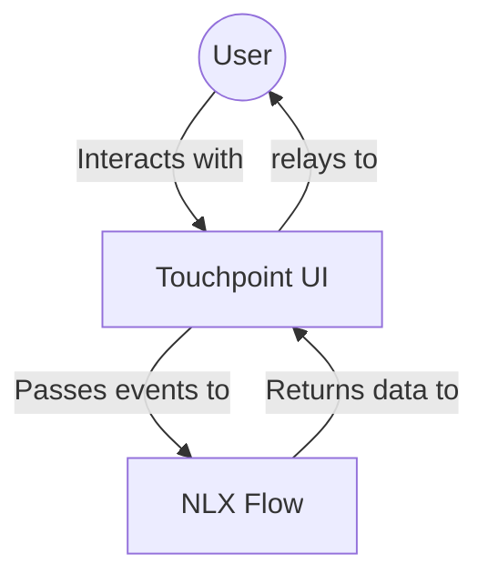

- [Architecture Overview](#architecture-overview)
- [Key Concepts to Explore](#key-concepts-to-explore)
- [Common Implementation Approaches](#common-implementation-approaches)

## Architecture Overview

Touchpoint UI, the Conversation Core, and the NLX API work together to deliver a seamless conversational experience. The NLX Platform is where you design the underlying conversational logic.

**Core Components at a Glance:**

  * **Touchpoint UI**: The visual front-end for user interaction.
  * **Conversation Core**: The engine managing conversation state and communication with the NLX API.
  * **NLX**: The NLX platform where you design conversational flows, intents, and modalities.

## Key Concepts to Explore

To make the most of Touchpoint UI, familiarize yourself with these concepts:

  * **Custom Components (Modalities)**: Extend Touchpoint UI with your own React components, driven by data from your NLX flows. This is ideal for displaying rich, interactive content beyond standard text messages.

      * *Recommended Reading*: [Custom Components Guide](/guide-building-custom-components)

  * **The ConversationHandler**: This JavaScript object is your main tool for programmatically controlling the conversation. Use it to send messages, trigger intents, and listen for updates.

      * *Recommended Reading*: [Conversation Handler Guide](/touchpoint-ui-ConversationHandler)

## Common Implementation Approaches

How you use Touchpoint UI can range from simple to highly customized:

  * **Simple Integration**: Get a Touchpoint interface up and running quickly with basic configuration.

      * *Recommended Reading*: See [Setup Guide](/touchpoint-ui-setup) for configuration options.

  * **Theming and Custom UI**: Tailor the visual appearance to match your brand and integrate unique interactive elements using custom components.

      * *Recommended Reading*: Explore the [Theming and Styling Guide](/touchpoint-ui-theming) and the [Custom Components Guide](/guide-building-custom-components).

  * **Programmatic Interaction**: Leverage the `ConversationHandler` to create dynamic experiences, respond to application-specific events, or integrate with third-party services based on the conversation flow.

      * *Recommended Reading*: Review guides on [Subscribing to Events](/guide-subscribing-to-events) and [Controlling Visibility](/guide-show-hide-touchpoint).
